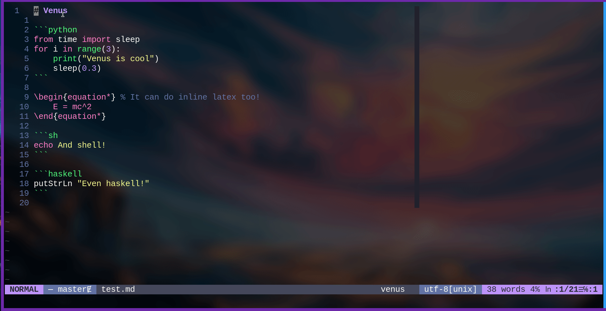

# Venus

It's like Jupyter, but lighter, faster, hotter, and sexier. Integrates any
language with a REPL along with  LaTeX into one markdown document. Currently
python and shell (posix/bash/zsh) are supported, but arbitrary REPLs can be
added. Haskell and R were supported in earlier versions and may be brought
back in the future.



## Installation

Use your favourite plugin manager. For example with
[Vundle.vim](https://github.com/VundleVim/Vundle.vim):
```vimscript
Plugin 'https://git.sr.ht/~ecc/vim-venus'
```

If you end up using it frequently, please subscribe to the announcement mailing
list by pinging
[~ecc/vim-venus-announce+subscribe@lists.sr.ht](mailto:~ecc/vim-venus-announce+subscribe@lists.sr.ht),
as there might be some breaking changes down the line.

# Dependencies

- An installation of pandoc with xelatex (e.g. `pandoc` and `texlive-most` on
  Arch Linux

- The REPLs you want to use (of course)

- Linux/BSD (this may work on other operating systems, and I will review PRs
  aimed at them, but I do not intend to actively maintain them)

Optional:

- An installation of `jupytext` to convert jupyter notebooks into markdown

- [SirVer/ultisnips](https://github.com/SirVer/ultisnips) and
  [honza/vim-snippets](https://github.com/honza/vim-snippets) to enable
  snippets

- [lervag/vimtex](https://github.com/lervag/vimtex) for advanced LaTeX usage

# Usage

Venus allows you to run code blocks from markdown into an output block. It is
enabled on all markdown files by default. Existing blocks generated by
Venus will be replaced.

Here is an example:

    ```sh
    echo "Hello world!"
    ```

will become

    ```sh
    echo "Hello world!"
    ```
    ```output
    Hello world!
    ```

Any errors which occur will also be put into the output block like so:

    ```python
    print("Hi world")
    6 = 0
    ```
    ```output
    Hi world
    File "<stdin>", line 1
        6 = 0
        ^
    SyntaxError: cannot assign to literal
    ```

Venus also provides a simple variable explorer for python and shell, which
shows variable names and their value in the quickfix list. This can be extended
to other languages.

By default vimtex is also started in markdown files (if it is installed). This
can be disabled, see [doc/venus.txt](./doc/venus.txt)

# Mappings

A number of mappings are enabled by default (they can be disabled). For a full
list see [doc/venus.txt](./doc/venus.txt) or `:help venus-maps`.

# Options

See [doc/venus.txt](./doc/venus.txt) or `:help venus-options`.

# Known Issues

See [doc/venus.txt](./doc/venus.txt) or `:help venus-known-issues`.

# Acknowledgements

This repository uses an extract from
[vim-pandoc-syntax](https://github.com/vim-pandoc/vim-pandoc-syntax) to achieve
inline latex syntax highlighting. See [syntax/venus.vim](./syntax/venus.vim)
for details
